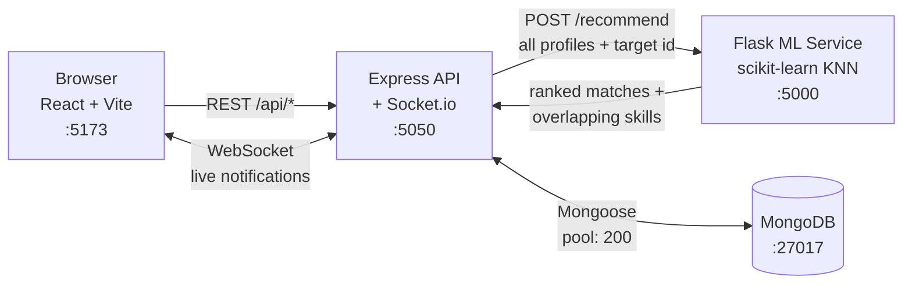

# SkillSwap | ML-Powered Peer Learning Platform

A full-stack peer learning platform where people trade skills instead of paying for them. If Alice teaches React and wants to learn Python, and Bob teaches Python and wants to learn React, the recommendation engine finds them each other.

The interesting part is that it does **not** look for similar users. It looks for *complementary* ones — see [How the matching works](#how-the-matching-works).

**Stack:** React 19 · Vite 8 · Node/Express · MongoDB · Socket.io · Python/Flask · scikit-learn

---

## Table of Contents

- [Architecture](#architecture)
- [Features](#features)
- [How the matching works](#how-the-matching-works)
- [Project structure](#project-structure)
- [Getting started](#getting-started)
- [Configuration](#configuration)
- [API reference](#api-reference)
- [Data model](#data-model)
- [Testing & verification](#testing--verification)
- [Troubleshooting](#troubleshooting)
- [Known limitations](#known-limitations)

---

## Architecture

Three services plus a database. The Node server owns all state and is the only thing that talks to MongoDB; the Flask service is stateless and does nothing but rank profiles it is handed.



**Why the ML service holds no state:** it receives every profile on each request and returns a ranking. That keeps it trivially restartable and means the model always reflects the current database, at the cost of recomputing per cache miss (see [Known limitations](#known-limitations)).

---

## Features

**Matching & discovery**
- Complementary recommendations ranked by a cosine-similarity KNN over a swapped skill/interest vector
- Every match names the *actual* skills behind it ("They can teach you **Python, Machine Learning**") rather than only a percentage, and ticks the specific badges responsible
- Browse the full directory with free-text search across name, bio, skills and interests
- Filter by a "Teaches" or "Wants to learn" tag chip, each showing how many people it applies to
- Paginated results that also report your existing relationship with each person

**Swaps**
- Send, accept, and decline swap requests
- Pending requests surface both in a dedicated tab and inline in the notification bell
- Accepted swaps expose the partner's email so the pair can arrange a first session

**Real time**
- Socket.io pushes a notification the instant a request is sent or accepted
- The bell badge, pending list, and recommendation feed all refresh without a reload
- Requests can be accepted or declined directly from the notification dropdown

**Profile**
- Skills-to-teach and skills-to-learn tag editors with suggestions and free-text entry
- Editing your profile invalidates the recommendation cache so new matches appear immediately

---

## How the matching works

Each profile becomes one vector: a binary indicator for every skill in the database, a binary indicator for every interest, plus two engineered counts.

```
profile = [ skills_onehot | interests_onehot | n_skills, n_interests ]
```

To find partners for a target user, the query vector **swaps the two halves**:

```
query   = [ interests_onehot | skills_onehot | n_interests, n_skills ]
             ↑ what I want            ↑ what I offer
             to learn, treated        treated as what
             as what they teach       they want to learn
```

A profile close to that query therefore teaches what the target wants to learn *and* wants to learn what the target teaches. `NearestNeighbors(metric='cosine')` then ranks everyone by distance to it.

### Feature weighting

The two count features are dense values living in an otherwise almost-entirely-zero tag space. At full weight inside a cosine distance they let *profile size* dominate actual complementarity — profiles sharing **no skills at all** scored ~23% and outranked genuine partial matches. They are scaled by `COUNT_FEATURE_WEIGHT` in [`ml-service/app.py`](ml-service/app.py) so they act as a mild tiebreaker instead.

### Worked example

Alice teaches `React, JavaScript, CSS, Figma` and wants to learn `Python, Machine Learning, Data Science`. Against the seeded data she gets:

| Rank | Candidate | Score | They can teach her | She can teach them |
|-----:|-----------|------:|--------------------|--------------------|
| 1 | Charlie Brown | 57% | Data Science, Python | CSS, Figma |
| 2 | Bob Smith | 46% | Machine Learning, Python | React |
| 3 | Diana Prince | 31% | — | JavaScript, React |
| 4 | Hannah Baker | 17% | — | Figma |
| 5+ | everyone else | ~0% | — | — |

Charlie outranks Bob because the swap is two-way on both sides (2 skills each direction) where Bob's is 2-and-1. Everyone with any overlap ranks above everyone with none.

---

## Project structure

```
skill-swap/
├── client/                       # React frontend (Vite)
│   ├── src/
│   │   ├── components/
│   │   │   ├── Navbar.jsx        # Nav + real-time notification bell
│   │   │   ├── MatchCard.jsx     # Shared by the recommend and browse tabs
│   │   │   ├── BrowseDirectory.jsx # Search, filter chips, pagination
│   │   │   └── ProfileSetup.jsx  # Skill/interest tag editors
│   │   ├── pages/
│   │   │   ├── Auth.jsx          # Login / register
│   │   │   └── Dashboard.jsx     # Recommended | Browse All | My Swaps
│   │   ├── App.jsx               # State, API calls, socket lifecycle
│   │   └── index.css             # Glassmorphic design system
│   └── index.html
│
├── server/                       # Node.js Express backend
│   ├── server.js                 # Bootstrap + Socket.io, online-user map
│   ├── routes.js                 # All API endpoints, auth, ML interface
│   ├── models.js                 # User, Match, Notification, ActivityLog
│   ├── db.js                     # Mongoose connection + pooling
│   ├── seed.js                   # Populates 16 test profiles
│   ├── .env.example              # Config template
│   └── .env                      # Local config (git-ignored)
│
├── ml-service/                   # Python Flask ML service
│   ├── app.py                    # Feature engineering, scaling, KNN
│   └── requirements.txt
│
└── package.json                  # Monorepo scripts (setup/seed/dev)
```

---

## Getting started

### Prerequisites

| Requirement | Version | Notes |
|-------------|---------|-------|
| Node.js | 18+ (22 recommended) | |
| Python | 3.10+ | |
| MongoDB | 6+ | Must be running on `localhost:27017` |

Verify MongoDB is up before starting — the server exits immediately if it cannot connect.

### One-time setup

```bash
# 1. Install JavaScript dependencies (root + server + client)
npm run setup

# 2. Create the Python virtual environment and install ML dependencies
cd ml-service
python -m venv .venv

# Windows PowerShell:  .venv\Scripts\Activate.ps1
# Windows CMD:         .venv\Scripts\activate.bat
# macOS / Linux:       source .venv/bin/activate

pip install -r requirements.txt
cd ..

# 3. (Optional) create your local config
cp server/.env.example server/.env

# 4. Populate the database with 16 test profiles
npm run seed
```

### Run everything

```bash
npm run dev
```

Starts all three services together via `concurrently`, then open **http://localhost:5173**.

### Run services individually

Useful when you want separate logs per service. Three terminals:

```bash
# Terminal 1 — ML service on :5000
cd ml-service && .venv/Scripts/python app.py    # or: python app.py, with the venv activated

# Terminal 2 — API on :5050
cd server && npm run dev                        # nodemon, restarts on change

# Terminal 3 — client on :5173
cd client && npm run dev
```

### Available scripts

| Command | Run from | Does |
|---------|----------|------|
| `npm run setup` | root | Installs root, server and client dependencies |
| `npm run seed` | root | Wipes and repopulates the database |
| `npm run dev` | root | Runs all three services together |
| `npm run start:server` | root | API only |
| `npm run start:client` | root | Client only |
| `npm run start:ml` | root | ML service only (needs the venv) |
| `npm run dev` | client | Vite dev server |
| `npm run build` | client | Production build to `client/dist` |
| `npm run lint` | client | ESLint |
| `npm run dev` | server | nodemon with auto-restart |

---

## Configuration

The server reads `server/.env`. Every value has a working local default, so the file is optional for development.

| Variable | Default | Purpose |
|----------|---------|---------|
| `PORT` | `5050` | Port for the Express + Socket.io server |
| `MONGO_URI` | `mongodb://localhost:27017/skillswap` | MongoDB connection string |
| `JWT_SECRET` | *(insecure dev fallback)* | Signs auth tokens — **change this for anything real** |
| `ML_SERVICE_URL` | `http://localhost:5000` | Base URL of the Flask service |
| `NODE_ENV` | `development` | Environment name |

`server/.env` is git-ignored. Commit changes to `.env.example` instead.

---

## API reference

All endpoints are prefixed with `/api`. Authenticated routes expect `Authorization: Bearer <token>`.

### Auth
| Method | Endpoint | Auth | Description |
|--------|----------|:----:|-------------|
| `POST` | `/auth/register` | — | Create an account, returns a token |
| `POST` | `/auth/login` | — | Log in, returns a token |

### Profile
| Method | Endpoint | Auth | Description |
|--------|----------|:----:|-------------|
| `GET` | `/users/profile` | ✔ | Current user's profile |
| `PUT` | `/users/profile` | ✔ | Update name, bio, skills, interests |

### Discovery
| Method | Endpoint | Auth | Description |
|--------|----------|:----:|-------------|
| `GET` | `/recommendations` | ✔ | ML-ranked complementary matches (cached 5 min) |
| `GET` | `/users/search` | ✔ | Browse everyone. Query: `q`, `skill`, `interest`, `page`, `limit` (max 50) |
| `GET` | `/skills` | ✔ | Every tag in use with teach/learn counts |

### Swaps
| Method | Endpoint | Auth | Description |
|--------|----------|:----:|-------------|
| `POST` | `/matches/request` | ✔ | Request a swap. Body: `{ recipientId }` |
| `POST` | `/matches/respond` | ✔ | Body: `{ matchId, action: 'accept' \| 'decline' }` |
| `GET` | `/matches` | ✔ | Accepted swaps, with partner contact details |
| `GET` | `/matches/pending` | ✔ | Incoming requests awaiting your response |

### Notifications
| Method | Endpoint | Auth | Description |
|--------|----------|:----:|-------------|
| `GET` | `/notifications` | ✔ | All notifications, newest first |
| `PUT` | `/notifications/read` | ✔ | Mark all as read |

### Socket.io events
| Direction | Event | Payload |
|-----------|-------|---------|
| client → server | `register_user` | `userId` — binds the socket to a user |
| server → client | `notification` | Notification with populated `sender` and `match: { _id, status }` |

### ML service (internal, port 5000)
| Method | Endpoint | Description |
|--------|----------|-------------|
| `GET` | `/health` | Liveness check |
| `POST` | `/recommend` | Body: `{ target_user_id, users[] }` → ranked recommendations |

---

## Data model

| Collection | Key fields | Indexes |
|------------|-----------|---------|
| **User** | `name`, `email` (unique), `password` (bcrypt), `skills[]`, `interests[]`, `bio` | `skills`, `interests` |
| **Match** | `requester`, `recipient`, `status: pending\|accepted\|declined` | `{requester, recipient}` unique, `recipient`, `status` |
| **Notification** | `recipient`, `sender`, `match`, `type`, `message`, `read` | `{recipient, read}` |
| **ActivityLog** | `user`, `action`, `details` | `{user, createdAt}` |

---

## Testing & verification

All 16 seeded accounts use the password `password123`.

**1. Recommendation quality**
Log in as `alice@skillswap.com`. You should see Charlie Brown (~57%) and Bob Smith (~46%) at the top, each card naming the specific skills behind the match, with people who share nothing sitting at ~0%.

**2. Browse & search**
Open **Browse All**. Search `photographer` to hit bios, filter by the `Python` chip under "Teaches" to get Bob and Charlie, or under "Wants to learn" to get Fiona and Nancy. Unlike the recommendation feed, browse shows *everyone*, labelling people you're already connected to or have a pending request with.

**3. Real-time notifications**
Open two browsers (or one plus an incognito window), logged in as Alice and Bob. Have Alice request a swap with Bob — Bob's bell rings immediately with a red badge, and he can accept or decline straight from the dropdown. Alice gets the acceptance in real time.

**4. Cache invalidation**
Edit your skills in the profile panel. The recommendation feed recomputes right away rather than waiting out the 5-minute cache.

---

## Troubleshooting

**"Recommendations unavailable" in the UI / API returns 503**
The Flask service isn't reachable. Confirm it with `curl http://localhost:5000/health`. The Node server degrades gracefully here — everything except recommendations keeps working.

**`Error: listen EADDRINUSE: address already in use :::5050`**
A previous run is still holding the port. Note that Flask's debug reloader spawns a child process that survives killing the parent, so ports can stay occupied after a terminal is closed.

```bash
# Windows
netstat -ano | findstr ":5050"
taskkill /PID <pid> /F

# macOS / Linux
lsof -ti:5050 | xargs kill -9
```

**`Error connecting to MongoDB` and the server exits**
MongoDB isn't running or isn't on `27017`. Start the service (`net start MongoDB` on Windows, `brew services start mongodb-community` on macOS) or point `MONGO_URI` elsewhere.

**Vite says "Port 5173 is in use, trying another one"**
Harmless — it picks the next free port. Use the URL printed in the terminal.

**The ML service returns stale results after a branch switch**
Flask's debug reloader watches file modification times, and a `git checkout` or `git pull` that rewrites `app.py` twice in quick succession can leave it serving the previous version. Symptom: recommendations come back with old scores or missing fields even though the file on disk is correct. Restart the service to fix it, and confirm with:

```bash
curl -s -X POST http://localhost:5000/recommend \
  -H "Content-Type: application/json" \
  -d '{"target_user_id":"1","users":[{"_id":"1","skills":["React"],"interests":["Python"]},{"_id":"2","skills":["Python"],"interests":["React"]}]}'
```

A current build returns `gives_skills` and `receives_skills` alongside the counts.

**A brand-new account shows everyone at 0%**
Expected. An empty profile produces an all-zero query vector, so there is nothing to match on. Add skills and interests and the feed populates.

**Two obviously-matching people don't match**
Skill tags are compared exactly and are case-sensitive, so `React` and `react` are different tags. Use the suggestion buttons rather than free text where possible — see [Known limitations](#known-limitations).

---

## Known limitations

Worth knowing before building on this:

- **Skill tags are free text and case-sensitive.** `React`, `react` and `ReactJS` are three unrelated dimensions, which silently degrades match quality. A canonical vocabulary with autocomplete would fix it.
- **The recommendation cache is in-process.** It does not survive a restart and would not be shared across multiple server instances.
- **Every profile is sent to the ML service on each cache miss.** Fine at seed scale; it would need precomputation or incremental indexing well before thousands of users.
- **Notifications only reach users who are currently online.** Offline users see them on next login, but nothing is emailed or pushed.
- **Declines are permanent.** There is no way to undo a pass, withdraw a sent request, or unmatch.
- **No automated test suite in the repository.** Verification is currently manual, following the steps above.
